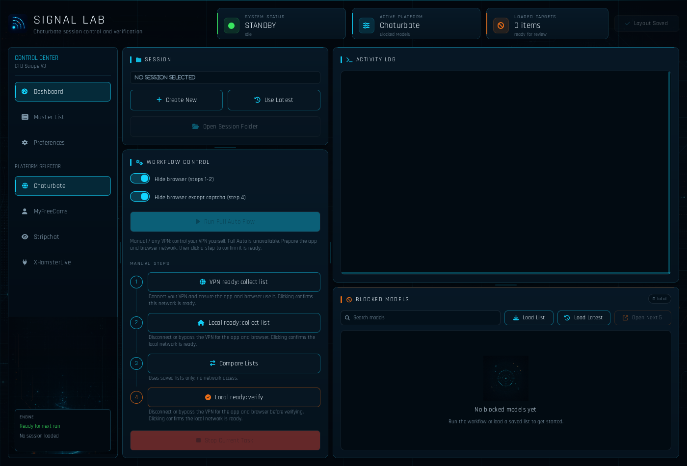
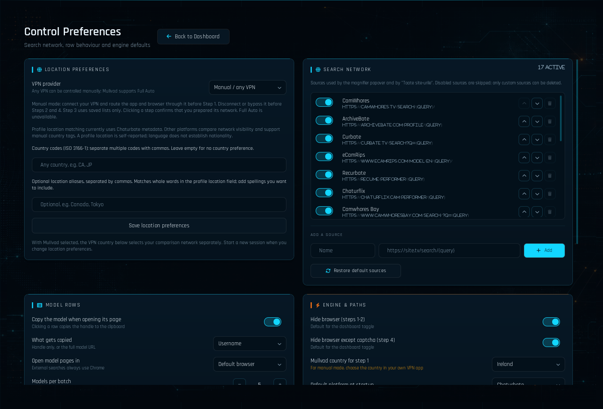

# ModelScraper

A local Windows application for comparing model availability across networks,
with a PySide6 desktop interface and a browser interface bound to `127.0.0.1`.
Supported platforms: Chaturbate, MyFreeCams, Stripchat and XHamsterLive.

This is a source release for contributors. It includes no account credentials,
browser cookies, session history, collected model lists or personal settings.



## Install and run

Install Python 3.11–3.14 (64-bit) and Google Chrome. **Mullvad is optional.**
The default **Manual / any VPN** mode works with a VPN you control yourself.
The optional Mullvad integration automates network switching and Chrome split
tunneling for Full Auto. No VPN subscription is included.

From the downloaded or cloned project directory:

```powershell
powershell -ExecutionPolicy Bypass -File scripts\bootstrap.ps1
```

Then run `Start ModelScraper GUI.bat` or `Start ModelScraper Web.bat`.
The Web launcher selects an available loopback port starting at 8788.
Launchers do not install dependencies automatically.

### First installation on Windows

1. Install a supported Python version with the Python launcher. Check installed
   versions in PowerShell with `py --list`.
2. Install Chrome. Install and sign in to your chosen VPN separately.
3. Download this repository as a ZIP and extract it to a writable folder, or
   clone its GitHub URL with Git. Do not run the app from inside a ZIP file.
4. Open PowerShell in that folder and run the bootstrap command above. It creates
   an isolated `.venv` and installs the application plus test dependencies.
   The first installation needs internet access and may take a few minutes.
5. Start the desktop launcher. Empty session/master lists are normal on a new
   installation: no model database is included.

The bootstrap defaults to Python 3.14. To select another installed version:

```powershell
powershell -ExecutionPolicy Bypass -File scripts\bootstrap.ps1 -PythonVersion 3.11
```

For a runtime-only installation, append `-RuntimeOnly`. Manual installation also
works without activating the virtual environment:

```powershell
py -3.14 -m venv .venv
.\.venv\Scripts\python.exe -m pip install -e ".[dev]"
.\.venv\Scripts\python.exe -m pip check
.\.venv\Scripts\python.exe gui_app.py
```

To start the Web interface from a terminal, run
`.\.venv\Scripts\python.exe web_app.py` and open the loopback address printed
there. Keep the terminal open while using the Web interface.

Use the source checkout and its editable installation. Standalone wheels and
packaged executables are not supported release formats: UI resources currently
live alongside the source files. Linux and macOS are not verified targets.

## Choose a location

Open **Preferences** on desktop, or the location settings panel in the Web UI.

- **Target countries:** one or more ISO two-letter country codes, such as
  `BR` or `DE,AT`. Leave empty for no specific country preference.
- **Location terms:** optional comma-separated words or place names from the
  profile location field, such as `Berlin,Hamburg`. These are text matches, not
  proof of residence. Language alone never establishes a country.
- **VPN provider:** choose **Manual / any VPN** or **Mullvad (automatic)**.
- **VPN country:** the comparison relay for Mullvad, independent of profile
  selection. In manual mode, choose the relay in your VPN application. The local
  comparison uses your actual non-VPN connection; selecting a profile country
  does not move that connection or prove its geolocation.

Country selection currently adds and prioritizes matching **Chaturbate** profile
records. The availability workflow still compares complete snapshots; it does
not silently discard other blocked candidates. Other platforms support network
comparison and manual country tagging/filtering, but do not yet extract equivalent
country evidence automatically. See [location behavior](docs/locations.md).

Settings are stored locally in `config/settings.json`. A Chaturbate session binds
its profile selection to `location_policy.json`. After changing the selection,
start a new session so snapshots and resumable runs cannot mix policies.

On desktop, country codes and aliases save together with **Save location
preferences**. Engine preferences save when changed. In Web, click
**Save preferences** to submit the form. Changes are rejected during a workflow.



| Goal | Country codes | Optional aliases | Behavior |
| --- | --- | --- | --- |
| No preferred profile location | empty | empty | Availability comparison without extra profile-priority extraction |
| Profiles reported in Brazil | `BR` | empty | Match the platform country code |
| Germany or Austria | `DE,AT` | empty | Match either reported country |
| Include a city claim | `DE` | `Berlin` | Match Germany **or** the location word Berlin; preserve reported country |

All 249 ISO country/territory codes are available. Country tags and master-list
filters are separate from these profile-selection settings.

## Use any VPN: manual walkthrough

Manual mode sends **no VPN control commands**. ModelScraper cannot inspect or
certify a third-party VPN's connection, kill switch or split-tunnel rules. Clicking
a network step confirms that you prepared the connection described by the button;
this operator declaration is separate from measured network state.

1. Select the platform and choose **Create New** (desktop) or **New Session**
   (Web). Configure profile locations
   first if using Chaturbate profile discovery.
2. Connect your VPN to the comparison country. Ensure Chrome uses that connection.
   If using HTTP collection, the Python process must use it too.
3. Click **Step 1** and wait for collection to finish. Keep the connection unchanged.
4. Disconnect your VPN, or configure your own split tunneling so Chrome and the
   collection process use your local connection. Check that the VPN kill switch
   does not prevent all traffic after disconnecting.
5. Click **Step 2** and wait for the local snapshot to finish.
6. Click **Step 3** to compare the saved snapshots. In manual mode this step does
   not need a network transition.
7. Keep the local connection active and click **Step 4** to verify candidates.
   Complete any CAPTCHA yourself in visible Chrome. Inconclusive results are
   not proof of a restriction.
8. Review the result and log. Reconnect your VPN yourself when finished.

Full Auto and Resume Full Auto are unavailable in manual mode. Re-run the manual
verification step where the platform supports a resumable checkpoint. Start a new
session after changing provider or location preferences.

**MyFreeCams:** Steps 1 and 2 also capture a recent on-air reference for each
connection. Verify in the same application session, within two minutes of the
VPN reference. After an application restart, missing reference or timeout,
repeat Steps 1 and 2; old lists do not establish that a model is still online.

## Optional Mullvad automation

1. Install Mullvad, sign in locally and confirm its CLI works. Do not put the
   account number or credentials in source files.
2. In desktop **Preferences → Location Preferences**, select **Mullvad (automatic)**.
   Choose its country under **Engine & Paths**. Supply Chrome/Mullvad executable
   paths there if detection fails.
3. Select a platform, create a fresh session and click **Full Auto**.
4. The application routes Chrome through the VPN, captures the VPN snapshot,
   switches to the local connection, compares snapshots and verifies candidates.
5. Wait for completion. On exit it attempts to restore the configured relay and
   exclude Chrome through Mullvad split tunneling. This is a specific end policy,
   not restoration of every pre-existing VPN setting.

Automatic control is currently implemented only for Mullvad. The provider boundary
in `vpn_providers.py` is the extension point for future automatic integrations.

## Workflow and local data

Manual Steps 1–4 and Full Auto compare a VPN snapshot with a local snapshot,
produce candidates, and verify them. Restrictions, accessibility and inconclusive
results are distinct observations. A profile match does not itself prove a
geographic restriction. A CAPTCHA requires manual completion in Chrome.

Automatic mode changes machine-wide VPN routing. Do not run another VPN-changing
tool alongside it. The application uses a machine-wide lock and refuses recovery
of another checkout's pending transaction. Manual mode leaves VPN control to you.

Session files are created under `cb sessions/`, `mfc sessions/`, `sc sessions/`
and `xhl sessions/` inside this checkout. Browser state is isolated under the
public edition's per-checkout application-data directory. No existing personal
checkout is imported or migrated automatically.

The Web interface is local and unauthenticated. Keep it bound to loopback.
Scraping endpoints and site behavior may change. Automated tests use synthetic
fixtures; they do not establish current compatibility with every live site.

## Results, stopping and resuming

The dashboard shows the current session, task status, live log and candidates.
Open **Master List** for saved results. Search, sort and filter by a country tag;
unknown country remains unknown. A country tag can be set manually.

- **PROFILE** means matching profile evidence for the current selection.
- **RESTRICTED PROFILE** combines matching evidence with a restriction observation
  from its session. It does not prove nationality, residence or a country-specific
  cause. Changing the selected location removes stale current-match badges.
- **NEW** is a display marker for additions in the application/session context.
- A candidate is not a final restriction verdict. Inspect the outcome and log.

Use **Stop Current Task** for an orderly cancellation. A stopped or incomplete
typed verification keeps its checkpoint instead of publishing a partial final
list. In Mullvad mode, use **Resume Full Auto** for a resumable session. In manual
mode, prepare the local connection and repeat **Step 4** where the platform has a
checkpoint. MyFreeCams requires fresh paired references as described above.

**Use Latest** selects a saved session for the active platform. It does not migrate
data from another installation. Selecting a historical session for viewing does
not mean its snapshots are compatible with changed location/provider settings.

## Troubleshooting

| Problem | What to check |
| --- | --- |
| Launcher says the environment is missing | Extract the whole repository, then run `scripts/bootstrap.ps1` from that directory. |
| `py` is not recognized or a Python version is missing | Install the Windows Python launcher and a supported 64-bit Python version; check `py --list` and use `-PythonVersion`. |
| Import or dependency error | Run bootstrap again, then `.venv\Scripts\python.exe -m pip check`. Start with this checkout's Python. |
| Chrome cannot be found | Set its executable path in desktop Preferences. Confirm Chrome starts normally. |
| Mullvad command fails | Choose Manual mode for another VPN, or verify Mullvad is installed, signed in, and its executable path is correct. |
| No internet after disconnecting VPN | Check your VPN's kill switch and app routing. ModelScraper does not control these in manual mode. |
| Manual Full Auto button is disabled | Expected. Prepare each connection yourself and use Steps 1–4. |
| Location policy or run config mismatch | Create a new session after changing selection/provider; do not hand-edit old fingerprints or reuse incompatible checkpoints. |
| Settings JSON is invalid | Correct `config/settings.json` while the app is stopped. Invalid operation settings are rejected to avoid silently changing collection behavior. |
| Another checkout owns machine policy | Resume/restore from the originating checkout. The public edition refuses to change its files or recover it. |
| A workflow is already running | Stop or finish the other GUI/Web workflow. Do not delete a lock to force simultaneous work. |
| CAPTCHA or site challenge | Complete it manually in the visible browser. Keep the run incomplete if the challenge cannot be resolved. |
| Empty or inconclusive snapshot | Check connectivity, routing and site changes. Do not interpret missing data as a confirmed restriction. |
| Web port is occupied | Use the Web launcher, which chooses a free port, or set `MODEL_SCRAPER_WEB_PORT` to another local port. |

For example, to choose a local Web port in the current PowerShell session:

```powershell
$env:MODEL_SCRAPER_WEB_PORT = "8795"
.\.venv\Scripts\python.exe web_app.py
```

## Platform support

| Capability | Chaturbate | MyFreeCams | Stripchat | XHamsterLive |
| --- | --- | --- | --- | --- |
| Manual / any VPN steps | Yes | Yes, recent paired references | Yes, declared network setup | Yes, legacy runner |
| Optional Mullvad Full Auto | Yes | Yes | Yes | Yes |
| Automatic profile location matching | Yes | Not implemented | Not implemented | Not implemented |
| Manual country tags / filtering | Yes | Yes | Yes | Yes |
| Durable typed verification checkpoints | Yes | No | Yes | No |

Support describes the implemented code paths. Live sites can change independently
of this release. This project does not include recording/downloading broadcasts.

## Contribute

Contributions and maintainers are welcome. Start with
[CONTRIBUTING.md](CONTRIBUTING.md) for the module map and verification commands.
Useful work includes country metadata adapters for other platforms, optional VPN
providers, source packaging, and better handling of incomplete site responses.

```powershell
.\.venv\Scripts\python.exe -m pytest -q
.\.venv\Scripts\python.exe -m pip check
.\.venv\Scripts\python.exe scripts\check_public_tree.py --ref HEAD
```

The release scanner checks an explicit source manifest and common secret/runtime
patterns. It supplements human review; do not attach real model lists, cookies,
HAR files or personal screenshots to issues. See [PRIVACY.md](PRIVACY.md).

## License

Project code is licensed under **GPL-3.0-only**. See [LICENSE](LICENSE).
Bundled fonts keep their own licenses, listed in [THIRD_PARTY_NOTICES.md](THIRD_PARTY_NOTICES.md).
